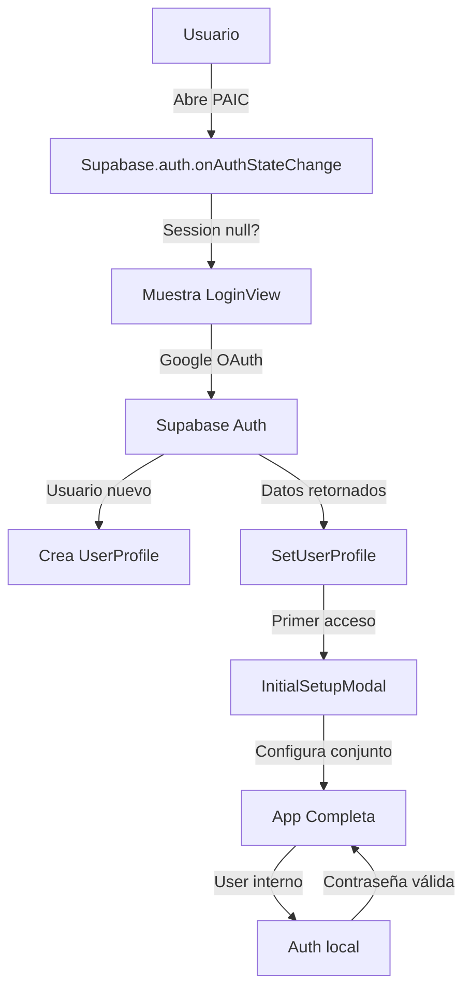

# 📚 DOCUMENTACIÓN COMPLETA - PAIC

**Plataforma de Administración Inteligente de Conjuntos**

Versión: 0.0.0  
Última actualización: 10 de junio de 2026

---

## 📑 Tabla de Contenidos

1. [Descripción General](#descripción-general)
2. [Características Principales](#características-principales)
3. [Arquitectura del Sistema](#arquitectura-del-sistema)
4. [Stack Tecnológico](#stack-tecnológico)
5. [Módulos y Vistas](#módulos-y-vistas)
6. [Funciones y Procedimientos](#funciones-y-procedimientos)
7. [Servicio de API](#servicio-de-api)
8. [Chatbot IA (Gemini)](#chatbot-ia-gemini)
9. [Base de Datos](#base-de-datos)
10. [Autenticación y Seguridad](#autenticación-y-seguridad)
11. [Roles y Permisos](#roles-y-permisos)
12. [Configuración y Deployment](#configuración-y-deployment)

---

## 🎯 Descripción General

PAIC es una plataforma web integral para la **administración inteligente de conjuntos residenciales**. Proporciona herramientas completas para gestionar:

- **Residentes y apartamentos**
- **Finanzas** (ingresos, gastos, presupuestos)
- **Seguridad** (visitantes, paquetes, control de acceso)
- **Comunicaciones** (correos masivos con IA)
- **Áreas comunes** (reservas, disponibilidad)
- **Tareas y vencimientos**
- **Documentos** (archivos compartidos)
- **Análisis y reportes**

**Propósito**: Automatizar y simplificar la administración de conjuntos usando inteligencia artificial y una interfaz intuitiva.

---

## ✨ Características Principales

### 1. **Panel de Control (Dashboard)**
- Resumen de datos en tiempo real
- Estadísticas de residentes, deudas, paquetes
- Centro de notificaciones prioritario
- Gráficos de ingresos vs gastos
- Tráfico de visitantes

### 2. **Gestión de Residentes**
- Base de datos centralizada
- CRUD completo (Crear, leer, actualizar, eliminar)
- Búsqueda y filtrado
- Import/export de datos (Excel)

### 3. **Finanzas Inteligentes**
- **Ingresos**: Cuota de administración, multas, alquiler de áreas, otros
- **Gastos**: Servicios, mantenimiento, nómina, administrativos
- Categorización automática
- Upload de archivos Excel para importación masiva
- Reportes gráficos (gráficos de barras, líneas, circular)
- Resumen financiero con balance

### 4. **Seguridad y Control de Acceso**
- Registro de visitantes
- Registro de paquetes/correspondencia
- Múltiples puntos de acceso (porterías)
- Historial de accesos
- Autorización de visitantes por apartamento
- Real-time updates con Supabase Realtime

### 5. **Comunicaciones Masivas**
- Envío de emails a grupos específicos
- Generación de contenido con IA (Gemini)
- Adjuntar documentos PDF
- Plantillas personalizables
- Registro de comunicaciones

### 6. **Áreas Comunes**
- Definición de espacios comunes
- Sistema de reservas
- Disponibilidad en calendario
- Gestión de conflictos de horarios

### 7. **Chatbot IA Integrado**
- Asistente powered by Google Gemini
- Ejecución de funciones automáticas:
  - Crear/actualizar residentes
  - Registrar paquetes
  - Autorizar visitantes
  - Crear reservaciones
  - Consultar información
  - Enviar emails masivos
  - Consultar base de datos

### 8. **Gestión de Archivos**
- Upload de documentos PDF
- Almacenamiento en nube (Supabase Storage)
- Compartir en comunicaciones
- Descarga y eliminación

### 9. **Gestión de Usuarios Internos**
- Personal de seguridad (guardias)
- Personal administrativo (contadores)
- Contadores
- Roles y permisos personalizables

### 10. **Panel Super Admin**
- Estadísticas de plataforma
- Monitoreo de conjuntos
- Gestión de suscripciones
- Análisis de uso del chatbot

---

## 🏗️ Arquitectura del Sistema

```
┌─────────────────────────────────────────────────────────┐
│                    INTERFAZ USUARIO                      │
│                   (React + TypeScript)                   │
├─────────────────────────────────────────────────────────┤
│  Header  │  NavBar  │  Dashboard  │  Modals  │  Chatbot │
├─────────────────────────────────────────────────────────┤
│              CAPA DE COMPONENTES REACT                   │
│  Views (Dashboard, Finanzas, Seguridad, etc.)           │
│  Modals (Edición, Configuración, Archivos)              │
│  UI (Icon, NotificationToast)                           │
├─────────────────────────────────────────────────────────┤
│            SERVICIOS Y LÓGICA DE NEGOCIO                │
│  - apiService.ts (API calls, CRUD)                      │
│  - geminiService.ts (Chatbot AI)                        │
│  - geminiTools.ts (Herramientas IA)                     │
│  - supabaseClient.ts (Conexión DB)                      │
│  - mercadoPagoService.ts (Pagos)                        │
├─────────────────────────────────────────────────────────┤
│              BACKEND / BASE DE DATOS                     │
│          Supabase (PostgreSQL + Auth)                   │
│  - user_profiles, residents, conjuntos                  │
│  - finances (incomes, expenses)                         │
│  - security (visitor_logs, package_logs)                │
│  - communications, files, reservations                  │
├─────────────────────────────────────────────────────────┤
│           SERVICIOS EXTERNOS / INTEGRACIONES            │
│  - Google Gemini API (IA)                               │
│  - Mercado Pago (Pagos)                                 │
│  - SendGrid/Bold (Email)                                │
└─────────────────────────────────────────────────────────┘
```

---

## 🛠️ Stack Tecnológico

### Frontend
| Tecnología | Versión | Propósito |
|-----------|---------|----------|
| **React** | 19.2.0 | UI Framework |
| **TypeScript** | ~5.8.2 | Tipado estático |
| **Vite** | 6.2.0 | Build tool |
| **Tailwind CSS** | Incluido en HTML | Estilos |
| **Recharts** | 3.3.0 | Gráficos y charts |
| **React DOM** | 19.2.0 | Renderización |

### Backend / BaaS
| Tecnología | Propósito |
|-----------|----------|
| **Supabase** | Base de datos PostgreSQL + Autenticación |
| **Supabase Auth** | OAuth (Google), autenticación interna |
| **Supabase Storage** | Almacenamiento de archivos |
| **Supabase Realtime** | Actualizaciones en tiempo real |

### IA y Servicios Externos
| Servicio | Versión | Propósito |
|---------|---------|----------|
| **Google Gemini** | 1.27.0 | Chatbot IA, generación de contenido |
| **Mercado Pago** | Integrado | Pagos y suscripciones |
| **Bold/SendGrid** | - | Envío de emails |

---

## 📱 Módulos y Vistas

### 1. **Tab.Dashboard** - Centro de Control
**Componente**: `DashboardView.tsx`
- Resumen ejecutivo
- Estadísticas clave:
  - Residentes en deuda
  - Tareas pendientes
  - Pagos vencidos
  - Paquetes por entregar
- Centro de notificaciones
- Gráficos:
  - Ingresos vs Gastos (Barras)
  - Gastos por categoría (Circular)
  - Volumen de paquetes
  - Tráfico de visitantes

### 2. **Tab.Database** - Base de Datos
**Componente**: `DatabaseView.tsx`
- Gestión de residentes
- CRUD completo
- Búsqueda y filtrado
- Importar/exportar Excel
- Estado de cuentas

### 3. **Tab.CommonAreas** - Áreas Comunes
**Componente**: `CommonAreasView.tsx`
- Definición de espacios
- Sistema de reservas
- Calendario de disponibilidad
- Gestión de conflictos

### 4. **Tab.Comunicaciones** - Comunicaciones
**Componente**: `ComunicacionesView.tsx`
- Envío masivo de emails
- Generación de contenido con IA
- Adjuntar documentos PDF
- Selección de destinatarios:
  - Todos
  - Deudores
  - Proveedores
  - Personal interno
- Plantillas

### 5. **Tab.Archivos** - Gestión de Documentos
**Componente**: `ArchivosView.tsx`
- Upload de PDF
- Almacenamiento en nube
- Descarga y eliminación
- Compartir en comunicaciones
- Límite: 5MB por archivo

### 6. **Tab.Finanzas** - Gestión Financiera
**Componente**: `FinanzasView.tsx`

**Sub-pestañas:**
- **Resumen**: Dashboard financiero
  - Ingresos totales
  - Gastos totales
  - Balance
  - Gráficos mensuales
  
- **Ingresos**: Registro de ingresos
  - Cuota de Administración
  - Multas
  - Alquiler de Áreas
  - Otros
  - Modal para crear/editar
  - Upload Excel
  
- **Gastos**: Registro de gastos
  - Servicios
  - Mantenimiento
  - Nómina
  - Administrativos
  - Otros
  - Modal para crear/editar
  - Asignación de proveedores
  - Upload Excel

**Funciones:**
- Crear ingreso/gasto
- Editar ingreso/gasto
- Eliminar ingreso/gasto
- Importar desde Excel
- Descargar plantilla
- Generar reportes

### 7. **Tab.Seguridad** - Control de Seguridad
**Componente**: `SeguridadView.tsx`

**Sub-pestañas:**
- **Visitantes**: Registro de visitantes
  - Nombre
  - Apartamento destino
  - Fecha y horario
  - Historial
  - Autorización previa
  
- **Paquetes**: Registro de paquetes
  - Apartamento
  - Courier
  - Número de seguimiento
  - Fecha de recepción
  - Historial

**Funciones:**
- Registrar visitante
- Registrar paquete
- Autorizar visitante
- Marcar paquete como entregado
- Historial filtrado

### 8. **Tab.DueDates** - Vencimientos
**Componente**: `DueDatesView.tsx`
- Fechas de vencimiento
- Categorías:
  - Servicios
  - Mantenimiento
  - Seguros
  - Nómina
  - Otros
- Estados: Pendiente, Vencido, Pagado
- Alertas visuales

### 9. **Tab.PendingTasks** - Tareas Pendientes
**Componente**: `PendingTasksView.tsx`
- Gestión de tareas
- CRUD de tareas
- Asignación de responsables
- Estados de progreso
- Prioridades

---

## ⚙️ Funciones y Procedimientos

### Procedimientos de Autenticación

#### 1. **Registro de Usuario (Administrador)**
```
1. Usuario accede a login (OAuth Google o email)
2. Si es primera vez, se crea perfil
3. Se genera período de prueba (14 días)
4. Se asigna rol "Trial" o "Subscriber"
5. Redirige a setup inicial
```

#### 2. **Login de Usuario Interno**
```
1. Personal (seguridad, contador) ingresa email/contraseña
2. Sistema valida contra tabla "users"
3. Se asignan permisos según rol
4. Se filtra acceso a módulos permitidos
```

#### 3. **Cierre de Sesión**
```
1. Se limpian canales Supabase
2. Se elimina sesión de auth
3. Se limpian datos locales
4. Redirige a login
```

### Procedimientos de Finanzas

#### 1. **Registrar Ingreso**
```
1. Admin abre modal "Nuevo Ingreso"
2. Ingresa: descripción, monto, categoría, fecha
3. Sistema valida datos
4. Guarda en tabla "incomes"
5. Actualiza balance automáticamente
6. Muestra confirmación
```

#### 2. **Importar Ingresos (Excel)**
```
1. Admin descarga plantilla
2. Rellena con datos (descripción, monto, categoría, fecha)
3. Carga archivo .xlsx
4. Sistema valida formato
5. Importa masivamente
6. Muestra resumen de operación
```

#### 3. **Generar Reporte**
```
1. Sistema calcula totales por periodo
2. Agrupa por categoría
3. Genera gráficos
4. Muestra balance vs proyección
```

### Procedimientos de Seguridad

#### 1. **Registrar Visitante**
```
1. Seguridad abre "Nuevo Visitante"
2. Ingresa: nombre, apartamento, fecha, horario
3. Sistema notifica residente (si está configurado)
4. Crea entrada en "visitor_logs"
5. Registra hora de entrada
```

#### 2. **Marcar Salida de Visitante**
```
1. Seguridad localiza visitante en historial
2. Hace clic en "Salida"
3. Sistema registra hora de salida
4. Calcula duración de visita
5. Cierra registro
```

#### 3. **Registrar Paquete**
```
1. Seguridad abre "Nuevo Paquete"
2. Ingresa: apartamento, courier, tracking
3. Especifica fecha de recepción
4. Sistema crea entrada en "package_logs"
5. Notifica residente si está configurado
```

### Procedimientos de Comunicaciones

#### 1. **Enviar Email Masivo**
```
1. Admin abre Comunicaciones
2. Redacta mensaje o usa IA
3. Selecciona destinatarios (grupo)
4. Adjunta documentos si necesario
5. Hace clic "Enviar"
6. Sistema valida email
7. Envía mediante edge function
8. Registra envío en log
```

#### 2. **Generar Contenido con IA**
```
1. Admin abre "Generar con IA"
2. Ingresa prompt/contexto
3. Gemini procesa solicitud
4. Propone 3 versiones
5. Admin selecciona la mejor
6. Se completa el campo
```

---

## 🔌 Servicio de API

### apiService.ts - Listado Completo

**Sección: User & Profile Management**

| Función | Parámetros | Retorna | Descripción |
|---------|-----------|---------|------------|
| `fetchUserProfile()` | userId: string | UserProfile \| null | Obtiene perfil de usuario |
| `updateUserProfile()` | profile: UserProfile | void | Actualiza perfil de usuario |
| `authenticateUser()` | email, password: string | PlatformUser \| null | Autentica usuario interno |

**Sección: Conjunto Management**

| Función | Parámetros | Retorna | Descripción |
|---------|-----------|---------|------------|
| `fetchConjuntoInfo()` | conjuntoId: string | ConjuntoInfo \| null | Obtiene info del conjunto |
| `updateConjuntoInfo()` | conjunto: ConjuntoInfo | void | Actualiza info del conjunto |
| `addConjuntoInfo()` | conjunto: ConjuntoInfo | void | Crea nuevo conjunto |

**Sección: Residents**

| Función | Parámetros | Retorna | Descripción |
|---------|-----------|---------|------------|
| `fetchResidents()` | conjuntoId: string | Resident[] | Lista residentes |
| `fetchResidentByApartment()` | conjuntoId, apartment: string | Resident \| null | Busca por apartamento |
| `addResident()` | conjuntoId, resident | void | Agrega residente |
| `updateResident()` | conjuntoId, resident | void | Actualiza residente |
| `deleteResident()` | conjuntoId, apartment: string | void | Elimina residente |
| `bulkUpsertResidents()` | conjuntoId, residents: Resident[] | Resident[] | Import masivo |

**Sección: Account Status**

| Función | Parámetros | Retorna | Descripción |
|---------|-----------|---------|------------|
| `fetchAccountStatus()` | conjuntoId: string | AccountStatus[] | Lista estado de cuentas |
| `fetchDebtors()` | conjuntoId: string | { apartment, name, balance }[] | Lista deudores |
| `addAccountStatus()` | conjuntoId, account | void | Agrega estado |
| `updateAccountStatus()` | conjuntoId, account | void | Actualiza estado |

**Sección: Providers**

| Función | Parámetros | Retorna | Descripción |
|---------|-----------|---------|------------|
| `fetchProviders()` | conjuntoId: string | Provider[] | Lista proveedores |
| `addProvider()` | conjuntoId, provider | void | Agrega proveedor |
| `updateProvider()` | conjuntoId, provider | void | Actualiza proveedor |
| `deleteProvider()` | conjuntoId, providerId: number | void | Elimina proveedor |

**Sección: Finances (Ingresos)**

| Función | Parámetros | Retorna | Descripción |
|---------|-----------|---------|------------|
| `fetchIncomes()` | conjuntoId: string | Income[] | Lista ingresos |
| `addIncome()` | conjuntoId, income | void | Agrega ingreso |
| `updateIncome()` | conjuntoId, income | void | Actualiza ingreso |
| `deleteIncome()` | conjuntoId, id: number | void | Elimina ingreso |
| `deleteAllIncomes()` | conjuntoId: string | void | Limpia todos |
| `bulkUpsertIncomes()` | conjuntoId, incomes | Income[] | Import masivo |

**Sección: Finances (Gastos)**

| Función | Parámetros | Retorna | Descripción |
|---------|-----------|---------|------------|
| `fetchExpenses()` | conjuntoId: string | Expense[] | Lista gastos |
| `addExpense()` | conjuntoId, expense | void | Agrega gasto |
| `updateExpense()` | conjuntoId, expense | void | Actualiza gasto |
| `deleteExpense()` | conjuntoId, id: number | void | Elimina gasto |
| `deleteAllExpenses()` | conjuntoId: string | void | Limpia todos |
| `bulkUpsertExpenses()` | conjuntoId, expenses | Expense[] | Import masivo |

**Sección: Security (Visitantes)**

| Función | Parámetros | Retorna | Descripción |
|---------|-----------|---------|------------|
| `fetchVisitorLogs()` | conjuntoId: string | VisitorLog[] | Lista visitantes |
| `addVisitorLog()` | conjuntoId, log | void | Registra visitante |
| `updateVisitorLog()` | conjuntoId, log | void | Actualiza registro |

**Sección: Security (Paquetes)**

| Función | Parámetros | Retorna | Descripción |
|---------|-----------|---------|------------|
| `fetchPackageLogs()` | conjuntoId: string | PackageLog[] | Lista paquetes |
| `addPackageLog()` | conjuntoId, log | void | Registra paquete |
| `updatePackageLog()` | conjuntoId, log | void | Actualiza paquete |

**Sección: Communications**

| Función | Parámetros | Retorna | Descripción |
|---------|-----------|---------|------------|
| `sendCommunicationEmail()` | recipients, subject, body, attachments, sender info | { success, error? } | Envía email masivo |

**Sección: File Management**

| Función | Parámetros | Retorna | Descripción |
|---------|-----------|---------|------------|
| `listFilesForConjunto()` | conjuntoId: string | StoredFile[] | Lista archivos |
| `uploadFileForConjunto()` | conjuntoId, file: File | void | Sube archivo |
| `deleteFileForConjunto()` | conjuntoId, fileName: string | void | Elimina archivo |

**Sección: Super Admin**

| Función | Parámetros | Retorna | Descripción |
|---------|-----------|---------|------------|
| `fetchAllConjuntos()` | - | ConjuntoInfo[] | Lista conjuntos |
| `fetchPlatformStats()` | - | PlatformStats | Estadísticas plataforma |
| `fetchSuperAdminChartData()` | - | SuperAdminChartData | Datos para gráficos |

---

## 🤖 Chatbot IA (Gemini)

### Servicios

**geminiService.ts** - Configuración principal
```typescript
- Inicialización de cliente Gemini
- Configuración de seguridad
- Streaming de respuestas
- Manejo de herramientas
```

**geminiTools.ts** - Herramientas disponibles

El chatbot puede ejecutar las siguientes acciones:

### Herramientas de Gestión de Residentes
| Herramienta | Parámetros | Descripción |
|-------------|-----------|------------|
| `addResident` | apartment, name, email, phone | Agrega nuevo residente |
| `updateResident` | apartment, data | Actualiza residente |
| `deleteResident` | apartment | Elimina residente |

### Herramientas de Gestión de Proveedores
| Herramienta | Parámetros | Descripción |
|-------------|-----------|------------|
| `addProvider` | company, specialty, email, phone | Agrega proveedor |
| `updateProvider` | company, data | Actualiza proveedor |
| `deleteProvider` | company | Elimina proveedor |
| `queryProviders` | specialty (opcional) | Lista proveedores |

### Herramientas de Gestión de Áreas Comunes
| Herramienta | Parámetros | Descripción |
|-------------|-----------|------------|
| `createReservation` | commonAreaName, apartment, date, startTime, endTime | Crea reserva |

### Herramientas de Consulta de Base de Datos
| Herramienta | Parámetros | Descripción |
|-------------|-----------|------------|
| `queryDatabase` | table (residents \| account_status), query_description | Consulta genérica |

### Herramientas de Comunicación
| Herramienta | Parámetros | Descripción |
|-------------|-----------|------------|
| `sendMassEmail` | group (all, debtors, providers, internal), subject, body | Envía email masivo |

### Herramientas de Registro de Seguridad
| Herramienta | Parámetros | Descripción |
|-------------|-----------|------------|
| `authorizeVisitor` | visitorName, apartment, date | Autoriza visitante |
| `registerPackage` | apartment, courier, trackingNumber | Registra paquete |

### Herramientas Financieras
| Herramienta | Parámetros | Descripción |
|-------------|-----------|------------|
| `addIncome` | description, amount, category, date | Agrega ingreso |
| `addExpense` | description, amount, category, date, providerId | Agrega gasto |

### Ejemplos de Uso del Chatbot

**Ejemplo 1: Registrar Residente**
```
Usuario: "Agrega a Juan Pérez en el apartamento 301, su email es juan@email.com y teléfono 3001234567"
Chatbot: [Ejecuta addResident con parámetros]
Respuesta: "He agregado a Juan Pérez en el apartamento 301. ¿Hay algo más que necesites?"
```

**Ejemplo 2: Registrar Paquete**
```
Usuario: "Registra un paquete para el apto 205 de FedEx con tracking 1234567890"
Chatbot: [Ejecuta registerPackage]
Respuesta: "Paquete registrado para apartamento 205. El residente será notificado."
```

**Ejemplo 3: Enviar Email Masivo**
```
Usuario: "Envía un email a todos los deudores recordándoles del pago pendiente"
Chatbot: [Solicita confirmación del contenido]
Usuario: [Confirma]
Chatbot: [Ejecuta sendMassEmail]
Respuesta: "Email enviado a X deudores."
```

**Ejemplo 4: Consultar Información**
```
Usuario: "¿Cuántos residentes tengo en deuda?"
Chatbot: [Ejecuta queryDatabase]
Respuesta: "Tienes 8 residentes en deuda por un total de $X"
```

---

## 💾 Base de Datos

### Esquema de Supabase

Todas las tablas tienen RLS (Row Level Security) habilitado para garantizar acceso solo a datos del conjunto correspondiente.

### Tablas Principales

#### 1. **conjuntos**
```sql
id: uuid (PK)
name: text
nit: text
address: text
adminName: text
adminEmail: text
adminPhone: text
subscriptionPlan: enum ('Free', 'Paid')
planPrice: decimal
registrationDate: timestamp
created_at: timestamp
updated_at: timestamp
```
**Índices**: id, subscriptionPlan

#### 2. **user_profiles**
```sql
id: uuid (PK) - references auth.users
email: text
fullName: text
avatarUrl: text
role: enum (Trial, Subscriber, Internal, Admin)
trialExpiresAt: timestamp
conjuntoId: uuid (FK)
permissions: array
created_at: timestamp
updated_at: timestamp
```
**Índices**: id, conjuntoId, role

#### 3. **residents**
```sql
id: bigint (PK)
conjunto_id: uuid (FK)
apartment: text
name: text
email: text
phone: text
created_at: timestamp
updated_at: timestamp
```
**Índices**: conjunto_id, apartment (unique combined)

#### 4. **account_status**
```sql
id: bigint (PK)
conjunto_id: uuid (FK)
apartment: text
lastPaymentDate: date
adminFeeValue: decimal
pendingInstallments: int
otherCharges: decimal
outstandingBalance: decimal
created_at: timestamp
updated_at: timestamp
```
**Índices**: conjunto_id, apartment

#### 5. **incomes**
```sql
id: bigint (PK)
conjunto_id: uuid (FK)
description: text
amount: decimal
category: enum (CuotaAdmin, Multas, AlquilerAreas, Otros)
date: date
created_at: timestamp
updated_at: timestamp
```
**Índices**: conjunto_id, date, category

#### 6. **expenses**
```sql
id: bigint (PK)
conjunto_id: uuid (FK)
description: text
amount: decimal
category: enum (Servicios, Mantenimiento, Nomina, Administrativos, Otros)
date: date
providerId: bigint (FK)
created_at: timestamp
updated_at: timestamp
```
**Índices**: conjunto_id, date, category, providerId

#### 7. **visitor_logs**
```sql
id: bigint (PK)
conjunto_id: uuid (FK)
accessPointId: int (FK)
visitorName: text
apartment: text
visitDate: date
entryTime: time
exitTime: time (nullable)
authorized: boolean
created_at: timestamp
updated_at: timestamp
```
**Índices**: conjunto_id, apartment, visitDate
**Realtime**: Habilitado

#### 8. **package_logs**
```sql
id: bigint (PK)
conjunto_id: uuid (FK)
accessPointId: int (FK)
apartment: text
courier: text
trackingNumber: text
receivedDate: date
deliveredDate: date (nullable)
created_at: timestamp
updated_at: timestamp
```
**Índices**: conjunto_id, apartment
**Realtime**: Habilitado

#### 9. **providers**
```sql
id: bigint (PK)
conjunto_id: uuid (FK)
company: text
specialty: text
email: text
phone: text
created_at: timestamp
updated_at: timestamp
```
**Índices**: conjunto_id, specialty

#### 10. **common_areas**
```sql
id: uuid (PK)
conjunto_id: uuid (FK)
name: text
description: text (nullable)
color: json
capacity: int (nullable)
created_at: timestamp
updated_at: timestamp
```
**Índices**: conjunto_id

#### 11. **bookings**
```sql
id: bigint (PK)
conjunto_id: uuid (FK)
commonAreaId: uuid (FK)
apartment: text
residentName: text
bookingDate: date
startTime: time
endTime: time
created_at: timestamp
updated_at: timestamp
```
**Índices**: conjunto_id, commonAreaId, bookingDate

#### 12. **tasks**
```sql
id: bigint (PK)
conjunto_id: uuid (FK)
title: text
description: text
status: enum (Pending, InProgress, Completed)
priority: enum (Low, Medium, High)
dueDate: date
assignedTo: text
created_at: timestamp
updated_at: timestamp
```
**Índices**: conjunto_id, status, dueDate

#### 13. **due_dates**
```sql
id: bigint (PK)
conjunto_id: uuid (FK)
item: text
category: enum (Servicios, Mantenimiento, Seguros, Nomina, Otros)
dueDate: date
status: enum (Pendiente, Vencido, Pagado)
created_at: timestamp
updated_at: timestamp
```
**Índices**: conjunto_id, dueDate, status

#### 14. **internal_staff**
```sql
id: bigint (PK)
conjunto_id: uuid (FK)
name: text
position: text
email: text
phone: text
created_at: timestamp
updated_at: timestamp
```
**Índices**: conjunto_id

#### 15. **access_points**
```sql
id: int (PK)
conjunto_id: uuid (FK)
name: text
description: text (nullable)
created_at: timestamp
updated_at: timestamp
```
**Índices**: conjunto_id

#### 16. **user_roles** (Roles Personalizados)
```sql
id: uuid (PK)
conjunto_id: uuid (FK)
name: text
permissions: array (Tab[])
created_at: timestamp
updated_at: timestamp
```
**Índices**: conjunto_id, name

#### 17. **users** (Personal Interno)
```sql
id: int (PK)
conjunto_id: uuid (FK)
email: text
password_hash: text
name: text
role: text
created_at: timestamp
updated_at: timestamp
```
**Índices**: conjunto_id, email

#### 18. **chatbot_interactions**
```sql
id: bigint (PK)
conjunto_id: uuid (FK)
userId: uuid (FK)
userMessage: text
botResponse: text
toolExecuted: text (nullable)
timestamp: timestamp
```
**Índices**: conjunto_id, userId, timestamp

---

## 🔐 Autenticación y Seguridad

### Flujo de Autenticación



### Métodos de Autenticación

1. **OAuth Google (Administradores)**
   - Redirect a Google Sign-In
   - Token JWT retornado
   - Crea o actualiza perfil automáticamente
   - Período de prueba asignado

2. **Email/Contraseña (Personal Interno)**
   - Tabla "users" con contraseñas hash
   - Validación en `authenticateUser()`
   - RPC stored procedure para seguridad

3. **Autenticación de Sesión**
   - Supabase maneja JWT tokens
   - Auto-refresco de tokens
   - RLS protege tablas

### Seguridad - Mejores Prácticas

✅ **Implementado:**
- RLS en todas las tablas
- Validación de entrada en frontend y backend
- Hash de contraseñas
- JWT tokens seguros
- CORS configurado en Supabase
- Variables de entorno sensibles

⚠️ **Recomendaciones:**
- SSL/TLS en producción
- 2FA para administradores
- Audit logs de cambios
- Backup automático
- Rate limiting en APIs

---

## 👥 Roles y Permisos

### Roles Predefinidos

#### 1. **Trial**
- Duración: 14 días
- Permisos: Acceso a todos los módulos
- Limitaciones:
  - Sin soporte prioritario
  - Sin acceso a Super Admin
  - Sin archivos históricos

**Módulos permitidos:**
```
- Dashboard
- Base de Datos
- Áreas Comunes
- Comunicaciones
- Archivos
- Finanzas
- Seguridad
- Vencimientos
- Tareas
```

#### 2. **Subscriber (Pagado)**
- Duración: Por suscripción activa
- Permisos: Acceso completo
- Beneficios:
  - Soporte técnico
  - Datos históricos
  - Integraciones premium

**Módulos permitidos:** Todos

#### 3. **Internal (Personal Interno)**
- Permisos: Según rol específico
- Tipos:
  - **Guard (Seguridad)**: Solo Tab.Seguridad
  - **Contador**: Solo Tab.Finanzas
  - **Admin Interno**: Múltiples módulos configurables

#### 4. **Admin (Super Admin)**
- Acceso: Todo (incluyendo panel super admin)
- Funciones:
  - Ver estadísticas plataforma
  - Gestionar conjuntos
  - Gestionar suscripciones
  - Gestionar archivos de conjuntos
  - Ver analytics del chatbot

### Permisos Granulares

```typescript
interface UserRoleDefinition {
  id: string;
  name: string;
  permissions: Tab[];  // Array de módulos permitidos
}
```

**Ejemplo:**
```json
{
  "name": "Guardia de Seguridad",
  "permissions": ["Seguridad"]
}

{
  "name": "Contador",
  "permissions": ["Finanzas", "Base de datos"]
}

{
  "name": "Admin Conjunto",
  "permissions": ["Centro de Control", "Base de datos", "Áreas comunes", "Comunicaciones", "Archivos", "Finanzas", "Seguridad", "Vencimientos", "Tareas pendientes"]
}
```

---

## ⚙️ Configuración y Deployment

### Variables de Entorno

Crear `.env.local` en raíz:

```bash
# Google Gemini
VITE_GEMINI_API_KEY=tu_api_key_gemini

# Supabase
VITE_SUPABASE_URL=https://your-project.supabase.co
VITE_SUPABASE_ANON_KEY=your_anon_key

# Mercado Pago (opcional)
VITE_MERCADO_PAGO_PUBLIC_KEY=your_mercado_pago_key

# Email Service
VITE_SENDGRID_API_KEY=your_sendgrid_key
# O
VITE_BOLD_API_KEY=your_bold_key
```

### Scripts NPM

```json
{
  "dev": "vite",           // Inicia servidor desarrollo
  "build": "vite build",   // Build producción
  "preview": "vite preview", // Preview build
  "lint": "tsc --noEmit"   // Valida tipos
}
```

### Instalación y Uso

```bash
# Instalación
npm install

# Desarrollo
npm run dev
# → http://localhost:3000

# Build producción
npm run build

# Preview del build
npm run preview

# Validar tipos
npm run lint
```

### Deployment Recomendado

**Opción 1: Vercel**
```bash
npm install -g vercel
vercel
# Variables de entorno en Vercel dashboard
```

**Opción 2: Docker**
```dockerfile
FROM node:20-alpine
WORKDIR /app
COPY package*.json ./
RUN npm install
COPY . .
RUN npm run build
ENV NODE_ENV=production
EXPOSE 3000
CMD ["npm", "run", "preview"]
```

**Opción 3: Traditional Server**
```bash
npm run build
# Copiar dist/ a servidor web
# Configurar reverse proxy (nginx/apache)
```

### Monitoreo Recomendado

- **Sentry**: Error tracking
- **LogRocket**: Session replay
- **Hotjar**: User analytics
- **Google Analytics**: Traffic tracking
- **Supabase Logs**: Backend monitoring

---

## 📊 Ejemplos de Uso

### Caso 1: Admin Nuevo - Primer Uso

```
1. Admin accede a app
2. Google OAuth login
3. Sistema crea UserProfile (Trial 14 días)
4. InitialSetupModal pide:
   - Nombre conjunto
   - NIT
   - Dirección
   - Datos de contacto
5. Sistema crea registro en tabla "conjuntos"
6. Dashboard muestra estado inicial
7. Admin empieza a agregar residentes
```

### Caso 2: Registrar Ingresos Masivos

```
1. Admin abre Finanzas → Ingresos
2. Hace clic "Descargar Plantilla"
3. Llena Excel con datos:
   - Descripción
   - Monto
   - Categoría
   - Fecha
4. Sube archivo
5. Sistema valida:
   - Formato correcto
   - Tipos de datos
   - Valores válidos
6. Muestra preview de importación
7. Admin confirma
8. Sistema inserta masivamente
9. Muestra "XX registros importados"
```

### Caso 3: Comunicación Automática con IA

```
1. Admin abre Comunicaciones
2. Hace clic "Generar con IA"
3. Escribe: "Recordar a los deudores sobre pago pendiente"
4. Gemini genera:
   - Propuesta 1
   - Propuesta 2
   - Propuesta 3
5. Admin selecciona la mejor
6. Se rellena campo "Cuerpo"
7. Selecciona grupo "Deudores"
8. Adjunta documento de políticas
9. Hace clic "Enviar"
10. Sistema valida
11. Edge function envía emails
12. Muestra confirmación: "Sent to 23 recipients"
```

### Caso 4: Seguridad - Visitante en Tiempo Real

```
1. Visitante llega a portería
2. Guardia abre Seguridad → Visitantes
3. Hace clic "Nuevo Visitante"
4. Ingresa:
   - Nombre: "Juan Gómez"
   - Apto: "405"
   - Fecha: 2026-06-10
   - Hora entrada: 14:30
5. Sistema registra en BD (Supabase Realtime)
6. Residente del apto 405 recibe notificación
7. Residente autoriza o rechaza
8. Sistema actualiza autorización
9. Guardia ve "Autorizado" y deja entrar
10. Cuando sale, guardia hace clic "Salida"
11. Sistema cierra registro con hora de salida
12. Historial se actualiza en real time
```

---

## 🔄 Integraciones Externas

### Google Gemini API
- **Versión**: 1.27.0
- **Uso**: Chatbot, generación de contenido
- **Límite**: 60 requests por minuto (free tier)
- **Configuración**: `geminiService.ts`

### Supabase
- **Auth**: OAuth Google, email/password
- **DB**: PostgreSQL con RLS
- **Storage**: S3-compatible para archivos
- **Realtime**: WebSocket para live updates
- **Functions**: Edge functions para emails

### Mercado Pago (Opcional)
- **Pago de suscripciones**
- **Webhook para confirmación**
- **Actualización automática de plan**

### Email (SendGrid o Bold)
- **Envío de emails masivos**
- **Templates personalizables**
- **Tracking de aperturas**
- **Webhook para bounces**

---

## 📝 Notas Importantes

### Limitaciones Actuales
- Máximo 5MB por archivo PDF
- Máximo 1000 residentes por conjunto (recomendado)
- Máximo 500 ingresos/gastos en import Excel

### Mejoras Futuras Recomendadas
- [ ] Dashboard móvil nativo (React Native)
- [ ] OCR para escaneo de recibos
- [ ] Integración con sistemas de cámaras CCTV
- [ ] Reportes automatizados mensuales
- [ ] Webhooks para integraciones personalizadas
- [ ] API REST pública para terceros
- [ ] Multi-idioma (En, Es, Pt)
- [ ] Dark mode
- [ ] Machine learning para predicción de deudas

### Troubleshooting

**Problema**: "Error de conexión a Supabase"
- Verificar VITE_SUPABASE_URL y VITE_SUPABASE_ANON_KEY
- Verificar internet
- Revisar status de Supabase (status.supabase.com)

**Problema**: Chatbot no responde
- Verificar VITE_GEMINI_API_KEY
- Revisar cuota en Google Cloud Console
- Verificar conexión a internet

**Problema**: Archivos no se suben
- Verificar tamaño < 5MB
- Verificar que sea PDF
- Verificar permisos de Supabase Storage RLS

---

## 📞 Soporte y Contacto

**Desarrollador**: Mauricio Pineda  
**Email**: mauricio@prodigung  
**GitHub**: mauriciop-dev/PAIC

**Reporte de Bugs**: GitHub Issues  
**Feature Requests**: GitHub Discussions

---

**Última actualización**: 10 de junio de 2026  
**Versión de documento**: 1.0.0
